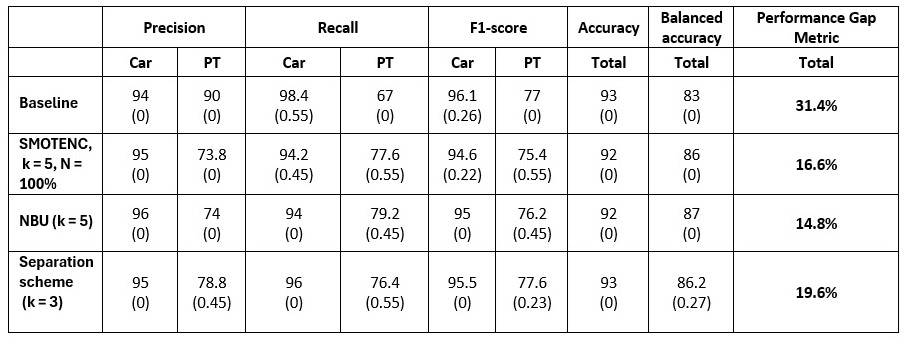
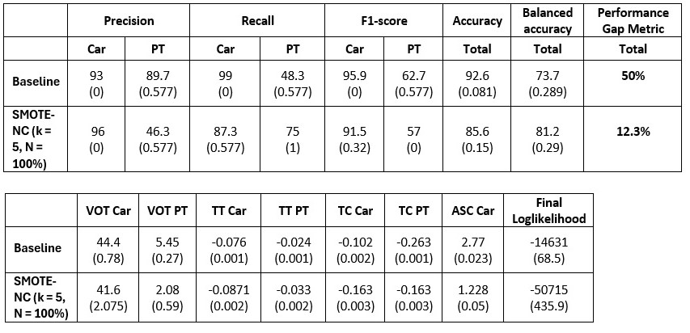

# Exploring the enhancement of predictive accuracy for minority classes in travel mode choice models.

## Objective

The primary objective of this project is to propose a framework to mitigate the effects of **class imbalance** on classification performance, specifically in the context of predicting travel mode choices in the Netherlands. Utilizing imbalanced data to forecast mode choices can lead to inaccurate forecasts, particularly reducing the number of correctly classified samples from minority classes (i.e., classes with fewer samples within the dataset) ([Johnson & Khoshgoftaar, 2019](https://doi.org/10.1186/s40537-019-0192-5)). Dependence on such model outcomes may result in inadequate provisions and resource allocation for minority modes, thereby leading to inequitable policies. Therefore, this project aims to contribute to efforts towards achieving an inclusive transportation system.

This project focuses on three primary modes: **car** (majority class), **bike**, and **transit** (minority mode), which includes trains, buses, trams, and metros. My exploration involves employing various techniques such as SMOTENC [Chawla et al., 2002](https://doi.org/10.1613/jair.953), Neighborhood-based Undersampling [Vuttipittayamongkol and Elyan, 2020](https://doi.org/10.1016/j.ins.2019.08.062), and Separation scheme [Xiong et al., 2013](https://doi.org/10.12785/amis/072l05) in conjunction with a Random Forest model and an Multinomial Logit (MNL) model, for both binary and multiclass classification tasks. Binary classification encompasses the car and transit classes, whereas multiclass classification also incorporates the bike class.

The framework proposed in the current study is depicted in the following image.

## Data Availability

Please note that data used in this project are not included in this repository due to privacy issues.

## Usage

All arguments are optional; if specific values are not provided, their default values are used. To specify an argument, follow the example below, where the MNL model is selected from the available models (MNL and Random Forest classifier), and the SMOTENC technique is chosen from the available techniques (SMOTENC, Neighborhood-based Undersampling, and the Separation scheme).

`python main.py --model=MNL --technique=SMOTENC`

## Evaluation and Results

The outcomes presented in this project pertain to the following scenarios:

- Generation of minority samples at proportions of 30%, 50%, and 100% relative to the majority samples using the SMOTENC technique.

- Setting the number of nearest neighbors to 5 in the SMOTENC technique, 3 and 5 in the NBU technique, and 2, 3, and 5 in the Separation scheme technique.

The tables depicted in the images below highlight the techniques that yielded the most favorable outcomes concerning the Performance Gap Metric. These instances indicate scenarios where the Performance Gap Metric has dropped below the 20% threshold, showcasing the classifier's ability to predict both majority and minority classes equally well.

For the MNL model, the reported values signify the average performance (%) of the model after 3-fold cross-validation, with standard deviation values shown in parentheses. Additionally, the Value of Time (VOT) is denoted in euros per hour. For the Random Forest classifier, the reported values represent the mean performance across five runs, with standard deviation values shown in parentheses. Additionally, for both models 'k' denotes the number of nearest neighbors, whereas 'N' signifies the percentage of generated minority samples relative to the majority samples.

#### Random Forest - Binary classification

#### Random Forest - Multiclass classification

#### MNL - Binary classification

#### MNL - Multiclass classification

## References

- Chawla, N. V., Bowyer, K. W., Hall, L. O., & Kegelmeyer, W. P. (2002). SMOTE: Synthetic Minority Over-sampling technique. Journal of Artificial Intelligence Research, 16, 321–357.[Link](https://doi.org/10.1613/jair.953)

- Johnson, J., & Khoshgoftaar, T. M. (2019). Survey on deep learning with class imbalance. Journal of Big Data, 6(1). [Link](https://doi.org/10.1186/s40537-019-0192-5)

- Vuttipittayamongkol, P., & Elyan, E. (2020). Neighbourhood-based undersampling approach for handling imbalanced and overlapped data. Information Sciences, 509, 47–70. [Link](https://doi.org/10.1016/j.ins.2019.08.062)

- Xiong, H., Li, M., Jiang, T., & Zhao, S. (2013). Classification Algorithm based on NB for Class Overlapping Problem. Applied Mathematics & Information Sciences, 7(2L), 409–415. [Link](https://doi.org/10.12785/amis/072l05)

